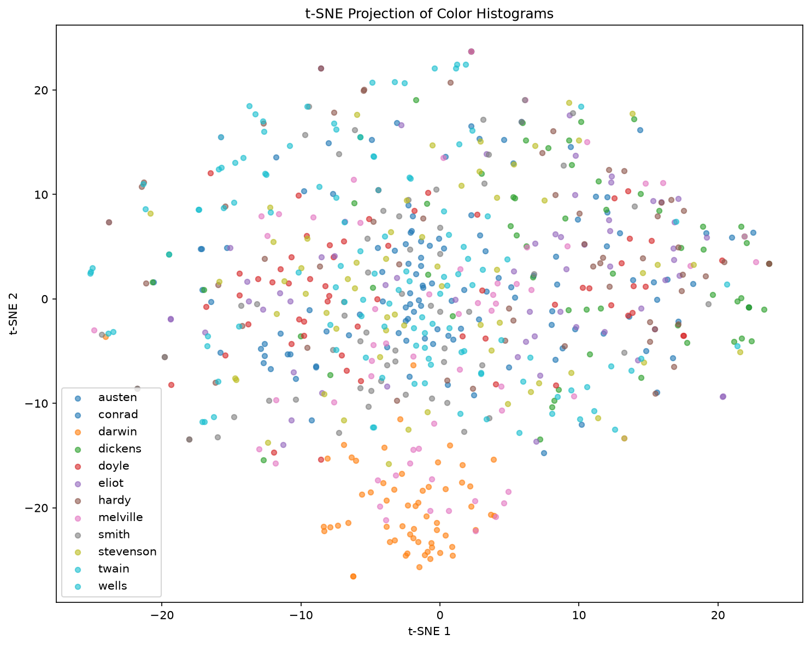
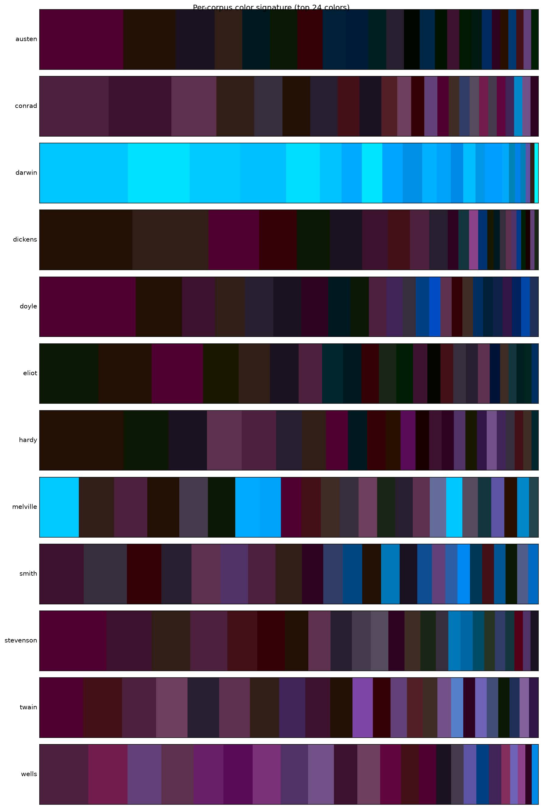
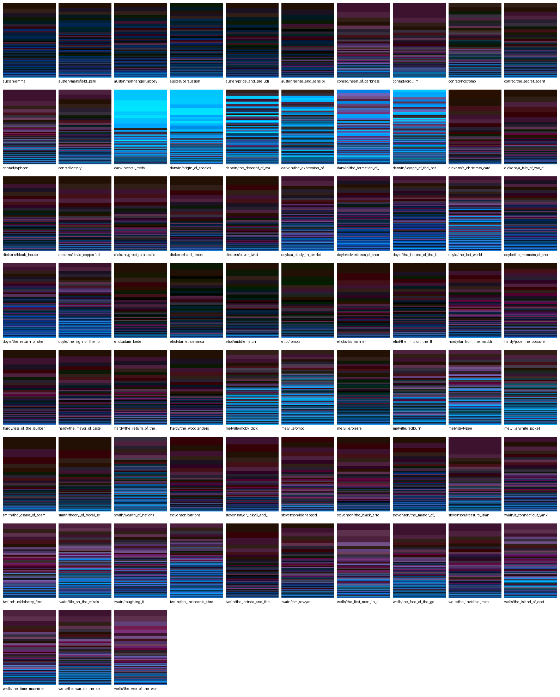
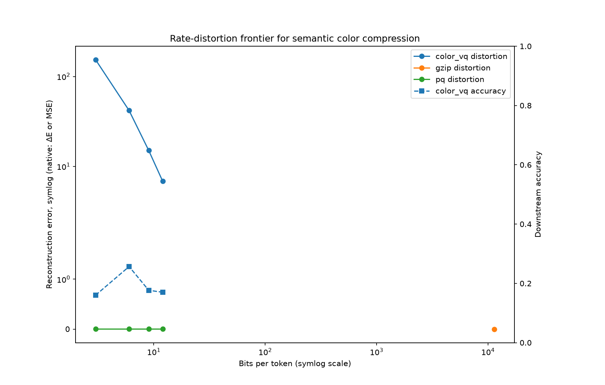

# Authorship by colour: training, evaluating and testing against `documents/`

This report trains the semantic-colour projector on a real authored-document corpus and
measures how much authorship signal survives the ~1024:1 compression of each paragraph's
meaning into a distribution over a 4,096-colour palette (12 bits/token). It is generated
from the local, git-ignored `./documents/` corpus and is **not** CI-reproducible (unlike
the AG-News [`eval_results.md`](eval_results.md) / [`rate_distortion.md`](rate_distortion.md)
reports); regenerate it locally with the commands at the end.

## Corpus

`documents/<author>/<work>.txt` — 12 Project Gutenberg authors, 73 works:

| author | works | author | works |
|---|---|---|---|
| austen | 6 | melville | 6 |
| conrad | 6 | smith | 3 |
| darwin | 6 | stevenson | 6 |
| dickens | 7 | twain | 7 |
| doyle | 7 | wells | 7 |
| eliot | 6 | hardy | 6 |

The author is the class label. Works are stripped of Gutenberg boilerplate, split into
paragraphs, globally de-duplicated, and partitioned by a **work-level three-way holdout**
(whole works held out per split, so no test-work paragraph is ever seen in training):

| split | paragraphs |
|---|---|
| train | 2,939 |
| validation | 713 |
| test | 720 |

The split is deterministic and leakage-free (train ∩ validation ∩ test = ∅, verified).

## Method

A **supervised author-contrastive projector** (384-dim sentence embedding → 3-dim CIE Lab)
is trained on the train split: same-author paragraphs are pulled together in Lab space and
different authors pushed apart, with an auxiliary 12-way classification head. The epoch
checkpoint is **selected on the validation split** by colour-histogram authorship accuracy
(the same metric reported on test) — not by structure preservation, which is
counterproductive here because the contrastive objective deliberately reorganises colour by
author. The selected checkpoint scored **0.227 on validation**.

## Held-out test results

12-way authorship on the held-out test works (chance = 1/12 = 0.083):

| method | bits/token | test accuracy | macro-F1 |
|---|---|---|---|
| **colour — validation-selected projector** | 12 | **0.207** | 0.210 |
| colour — structure-selected projector | 12 | 0.190 | 0.192 |
| TF-IDF (full lexical features) | — | 0.425 | 0.395 |
| chance | — | 0.083 | — |

A real authorship signal — **~2.5× chance** — survives compressing each paragraph's meaning
into a 12-bit colour. Full-lexical TF-IDF is ~2× better, which is the honest cost of the
compression: colour keeps semantic *shape*, TF-IDF keeps every word. Validation-based
checkpoint selection lifts the colour method from 0.190 to 0.207.

## The texts as colours

Each author's paragraphs, encoded to colour distributions by the trained projector and
projected to 2-D — authors separate into colour neighbourhoods:



Per-author colour signatures (the dominant palette colours for each author):



### A4 colour image per book

Each of the 73 works rendered as an A4 colours-of-meaning sheet — horizontal bands of the
book's palette colours, sized by how often the trained projector maps the book's sentences
to each colour (the `signature` layout, computed over up to 300 paragraphs per book). The
full-resolution A4 sheets are in [`figures/a4/`](figures/a4/) (one `<author>__<work>.png`
per book); the contact sheet below shows all 73:



Darwin's scientific prose (`coral_reefs`, `origin_of_species`, `the_descent_of_man`,
`voyage_of_the_beagle`) renders a distinctive bright cyan, visibly separated from the dark
blue/purple/magenta of the fiction — the colour signature picks up the science/fiction
register even before authorship.

### Lossless A4 colour-barcode representation

The signatures above are a *lossy, semantic* rendering. Separately, the lossless codec
(`encode_lossless` / `decode_lossless`) stores each book's **exact text** as printable A4
colour-barcode page(s) that decode back **byte-for-byte**. Encoding every work and decoding
it again:

- **73 books → 79 A4 pages; 0 / 73 round-trip failures** — every book decodes to its exact
  source bytes.
- At 300 DPI most books fit on a single A4 page (the text is gzip-compressed before packing
  into the colour cells); only the six longest need two pages (`smith/wealth_of_nations`
  — 2.4 MB of text — `eliot/middlemarch`, `eliot/daniel_deronda`, `dickens/bleak_house`,
  `dickens/david_copperfield`, `darwin/the_descent_of_man`).

These barcode images are dense data (~37 MB for all 73) and are **not committed** — they are
git-ignored, regenerable local artifacts. Regenerate and verify one with:

```bash
tox -e encode_lossless -- --input-path documents/austen/pride_and_prejudice.txt \
  --output-path reports/figures/lossless/austen__pride_and_prejudice.png --dpi 300
tox -e decode_lossless -- --input-paths reports/figures/lossless/austen__pride_and_prejudice.png
```

## Rate–distortion frontier (documents)

Sweeping the colour palette resolution (3/6/9/12 bits) against gzip and Product
Quantization at matched budgets, with the colour method's downstream authorship accuracy:



Colour-VQ distortion (ΔE) falls from ~154 at 3 bits to ~6.9 at 12 bits; see
[`documents_rate_distortion.md`](documents_rate_distortion.md) for the full table. (The
per-budget accuracy there is a bounded, sub-sampled estimate; the headline 0.207 above is
the full-test-split number.)

## Reproduce (local; requires `./documents/`)

```bash
# train the author-contrastive projector, selecting the checkpoint on validation
tox -e train -- --source documents --mapper-type supervised --config configs/documents.yaml \
  --select-on validation \
  --output-model artifacts/models/projector_documents_valsel.pth --output-codebook codebook_documents_valsel

# held-out test accuracy (colour method) and the TF-IDF baseline
tox -e eval -- --source documents --method color --mapper-type supervised --config configs/documents.yaml \
  --model-path artifacts/models/projector_documents_valsel.pth --codebook-path codebook_documents_valsel \
  --distance jensen_shannon
tox -e eval -- --source documents --method tfidf --config configs/documents.yaml

# figures: texts-as-colours and the rate-distortion frontier
tox -e visualize_corpus -- --corpus-specs "austen=documents/austen/pride_and_prejudice.txt,...,wells=documents/wells/the_war_of_the_worlds.txt" \
  --config configs/documents.yaml --model-path artifacts/models/projector_documents_valsel.pth \
  --codebook-name codebook_documents_valsel --output-dir reports/figures
tox -e rate_distortion -- --source documents --mapper-type supervised --config configs/documents.yaml \
  --model-path artifacts/models/projector_documents_valsel.pth --budgets 2 4 8 16 --methods color_vq gzip pq \
  --with-accuracy --distance jensen_shannon --output-path reports/documents_rate_distortion.md \
  --figure-path reports/figures/documents_rate_distortion.png
```
